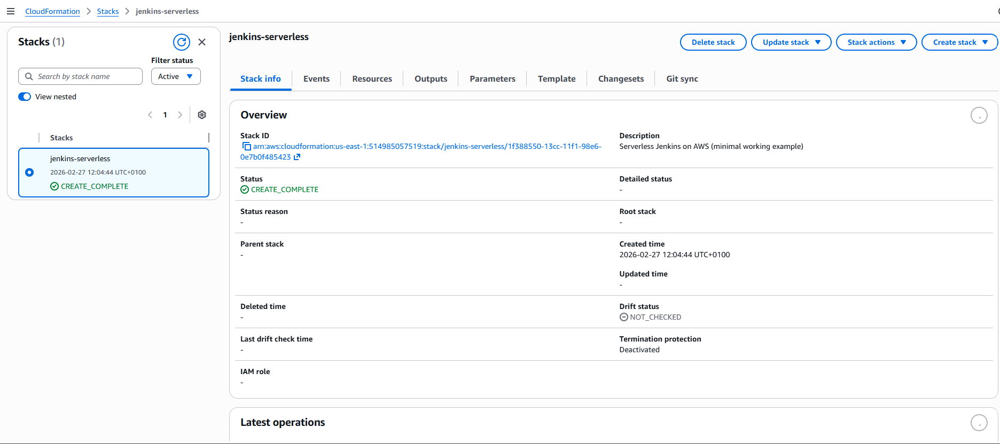
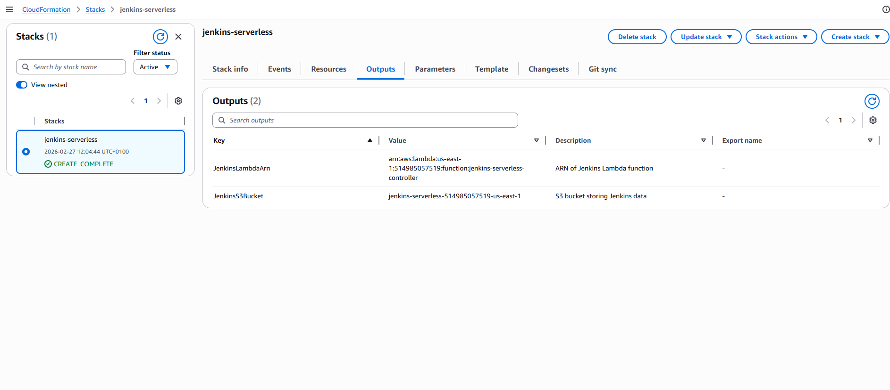
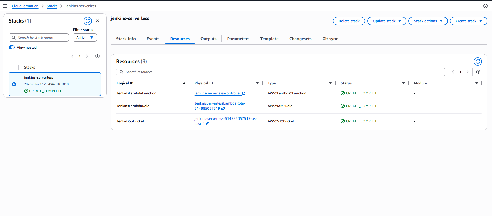

# Jenkins CI/CD Proof of Concept (POC)

## Project Overview

This project demonstrates a **full CI/CD pipeline using Jenkins**.  
It consists of two parts:

- **Part 1:** Traditional Jenkins deployment on EC2  
- **Part 2:** Serverless Jenkins deployment on AWS  

The goal is to validate Jenkins as a CI/CD tool, integrate it with GitHub, and explore modern **serverless CI/CD architecture**.

---

## 🔹 Part 1 – Jenkins POC on EC2

### Overview

- Jenkins 2 deployed on an EC2 instance  
- Connected to a **GitHub repository** for version control  
- Pipeline implemented with **four stages**:
  1. Checkout
  2. Build
  3. Test
  4. Deploy  

### Pipeline Highlights

- Declarative pipeline using a Jenkinsfile in GitHub  
- GitHub integration allows automatic checkout and pipeline triggering  
- Build, test, and deploy steps are simulated using `echo` commands  
- Pipeline as Code enables version-controlled automation

### Key Findings

- Jenkins requires **persistent storage** for jobs and plugins  
- Plugins are essential for functionality and integration  
- Pipeline as Code simplifies updates and version control  
- EC2-based Jenkins works well for POC but requires **manual maintenance**  

### Screenshots

- Jenkins Dashboard with pipeline configured  
- Pipeline execution showing stages running successfully  
- Build success confirmation  
- GitHub integration verified  

---

## 🔹 Part 2 – Serverless Jenkins on AWS

### Overview

- Jenkins deployed **serverlessly** using **AWS Lambda** for the controller  
- Deployment automated via **CloudFormation** (`jenkins-serverless.yaml`)  
- Jenkins data persisted in **S3 bucket** (`JenkinsS3Bucket`)  
- Lambda handles pipeline orchestration and execution  
- Fully managed, scalable, and **no server maintenance required** 

### Architecture Highlights

- CloudFormation provisions all necessary AWS resources:  
  - S3 bucket for Jenkins data  
  - Lambda function as Jenkins controller  
  - IAM roles for Lambda execution and S3 access  
  - CloudWatch logging  
- Serverless architecture ensures auto-scaling and no EC2/Fargate management  

### Pipeline Highlights

- Pipeline executed on serverless infrastructure  
- Same stages: **Checkout → Build → Test → Deploy**  
- Logs can be reviewed in **CloudWatch** for debugging and monitoring  
- CloudFormation makes redeployment and updates reproducible  

### Key Findings

- Serverless Jenkins eliminates server management overhead  
- Fully scalable with AWS-managed resources  
- S3 ensures persistent storage for Jenkins data  
- CloudFormation simplifies infrastructure provisioning and version control  

### Screenshots

1. **Stack Overview**  
     

2. **Stack Outputs**  
     

3. **Stack Resources**  
   
   
## 🔹 GitHub Repository

- Repository Name: **Jenkins**  
- Contains:
  - `README.md` (this file)  
  - `Jenkinsfile` for pipeline  
  - Screenshots folder  
- Collaborator: ClintonChe (reviewer assigned)

---
Author:
Sylvia, Jenkins Capstone Project
